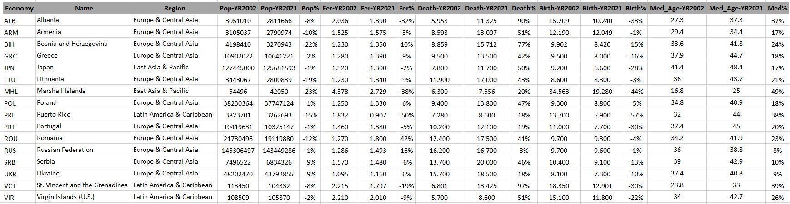

# Population_Collapse_IA
Modelo de series temporais para previsão do colapso populacional utilizando dataset extraído de sites do Banco Mundial e da ONU

## Dados de séries temporais de colapso populacional do mundo
O colapso populacional é um risco muito maior para a civilização (Elon Musk)

### Sobre o conjunto de dados

#### Fundo:
O conjunto de dados submetido é extraído usando sites do Banco Mundial e da ONU para encontrar o colapso populacional de acordo com países e regiões. O código gera dados para sete indicadores com base na data atual e está disponível do Ano 2000 ao ano 2021.

Este código é útil para fins de pesquisa, há nove arquivos CSV distintos associados a este código, sete deles lidam com indicadores, um arquivo CSV pertencente a grupos de países e o último arquivo CSV é uma análise de 20 anos entre sete indicadores. Abaixo estão sete indicadores extraídos dos sites do Banco Mundial e das Nações Unidas.

#### Indicadores:
População total, crescimento populacional, expectativa de vida ao nascer, taxa de fertilidade, taxa de mortalidade (por 1.000 pessoas), taxa de natalidade (por 1.000 pessoas), idade média

#### Definição:
O colapso populacional é calculado usando População Total, Crescimento Populacional, Expectativa de Vida ao Nascer, Taxa de Fertilidade, Taxa de Mortalidade, Taxa de Natalidade e Idade Mediana, para isso vários critérios foram aplicados para extrair dados:

#### Metodologia:
Os dados foram filtrados com base em vários atributos, os primeiros ids e o título foram extraídos dos dados do banco mundial, depois o período e as colunas foram fornecidos para extrair os dados. Esse processo de filtragem garantiu que apenas dados relevantes atendessem aos critérios especificados. Para a idade média, o site da ONU é usado e os dados são extraídos para todos os países. Os dados da idade média não estão disponíveis para grupos ou regiões; no entanto, eles podem ser calculados, pois os dados da idade média estão disponíveis para todos os países do globo.

Variáveis: Economia, Sete Indicadores Anos de 2000 a 2021

Para arquivos de grupos de países, todos os países são atribuídos de acordo com regiões, grupos, empréstimos, renda, etc. Portanto, para este arquivo, cada país é repetido, pois um país é membro de mais de um grupo.

#### Análise:
A captura de tela abaixo é extraída para aqueles países cuja população cai em 20 anos e a taxa de mortalidade aumenta enquanto a taxa de natalidade diminui. Então, por exemplo, a população da Ucrânia no ano de 2002 era de 48,2 milhões, enquanto no ano de 2021 sua população diminuiu em 9% para 43,8 milhões, da mesma forma, sua taxa de mortalidade aumentou de 15,7 para 18,5 (por 1000 pessoas) e a taxa de natalidade diminuiu em 10% de 8,10 para 7,30.

all_indicators.csv
| Economy  | Pop 2002 | Pop 2021 | Pop% | Life 2002 | Life 2021 | Life | Fer 2002 | Fer 2021 | Fer |
|----------|----------|----------|------|-----------|-----------|------|----------|----------|-----|
| Economia | População 2002 | População 2021 | % Mudança População | Expectativa de vida 2002 | Expectativa de vida 2021 | Mudança na expectativa de vida | Taxa de Fertilidade 2002 | Taxa de Fertilidade 2021 | Mudança na taxa de fertilidade |

country_groups_all.csv	
| id  | Country | Group| Group Type | iso2Code | capitalCity | navigationlongitude |navigationlatitude | Fer 2021 | Fer |
|----------|----------|----------|------|-----------|-----------|------|----------|----------|-----|
| ID da economia |	Nome da economia | Grupo | Tipo de grupo | ID da economia (2 alfabetos) | Capital da Economia | Longitude da Economia | Latitude da Economia |
                              								
total_Life_expectancy_at_birth.csv, total_birth_rate.csv, total_death_rate.csv, total_fertility_rate.csv, total_median_age.csv, total_population.csv, total_population_growth.csv		
| economy  | Year 2000 | Year 2001| Year 2002 | Year 2003 | Year 2004 | Year 2005 |Year 2006 | Year 2007 | Year 2008 |
|----------|----------|----------|------|-----------|-----------|------|----------|----------|-----|
| Economia | Ano | Ano | Ano |  Ano |  Ano |  Ano |  Ano |  Ano |  Ano |  	 	 	 				
		

